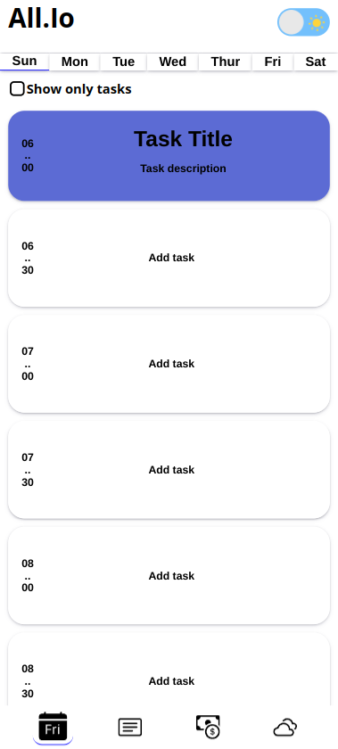

# All.Io - React App

Welcome to All.Io, a versatile React app designed to help you stay organized and manage your daily tasks, take notes, track your finances, and even check the weather forecast. This README will provide you with an overview of the main features of the app, installation instructions, and screenshots of each screen.

## Table of Contents

- [Features](#features)
- [Installation](#installation)
- [Screenshots](#screenshots)
- [Weather Forecast](#weather-forecast)
- [Download](#download)
- [Contributing](#contributing)
- [License](#license)

## Features

All.Io offers the following main functionalities:

1. Weekly Task Organization: Users can add and edit tasks for their week and day, defining the schedule, name, and duration of each task. The tasks will be displayed on the user's screen, providing a clear overview of their daily schedule.

2. Note-Taking: The app provides a note-taking feature where users can create multiple note blocks. Each note block has a title, and by clicking on a note, users can access the text they have written within it. This feature helps users keep track of important information and ideas.

3. Financial Organization: All.Io allows users to manage their financial transactions by adding them monthly. Users can create expense categories, and when adding a transaction, the app automatically groups it by category. Users can add both positive transactions (e.g., income, sales) and negative transactions (e.g., utility bills, groceries). The app provides a summary of the monthly balance.

4. Weather Forecast (Upcoming): All.Io will soon include a weather forecast feature. It will display the weather information for your current location or the state you specify, providing you with valuable insights to plan your day accordingly.

## Installation

To run All.Io on your local machine, follow these steps:

1. Make sure you have [Node.js](https://nodejs.org) installed.

2. Clone this repository:
   ```
   git clone https://github.com/HumbertoCastro/All.Io.git
   ```

3. Navigate to the project's root directory:
   ```
   cd All.Io
   ```

4. Install the dependencies:
   ```
   npm install
   ```

5. Start the development server:
   ```
   npm start
   ```

## Screenshots

Here are some screenshots of the All.Io app:

1. Weekly Task Organization:
   
   

2. Note-Taking:
   
   

3. Financial Organization:
   

## Weather Forecast

The upcoming weather forecast feature will be available soon, providing you with accurate weather information to help you plan your day effectively.

## Download

To download the APK file of All.Io and install it on your mobile device, please click [here](https://drive.google.com/file/d/1uRcNsYfiOJC1EwLjPl5MTyfnHWUY-B0m/view?usp=sharing).

## Contributing

We welcome contributions to improve All.Io. If you have any ideas, bug reports, or feature requests, please submit them as issues or create a pull request with your changes. We appreciate your contributions.

## License

This project is licensed under the MIT License (Non-Commercial Use Only). Please see the [LICENSE](./LICENSE) file for more details. For commercial licensing inquiries, please contact [humberto-dev@hotmail.com].